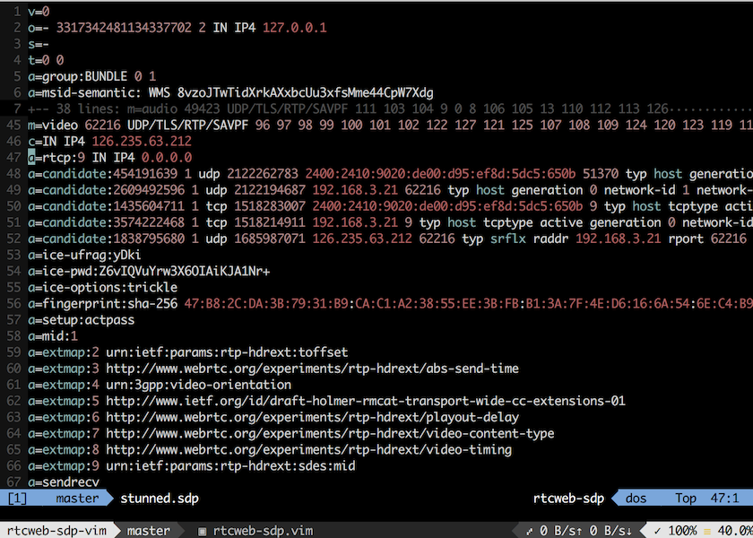

# rtcweb-sdp.vim
WebRTC flavored SDP syntax file for Vim.

Note: This syntax file was written based on [a draft of ietf item](https://tools.ietf.org/html/draft-ietf-rtcweb-sdp).



# Installation
With vim-plug, 

```vim
Plug 'matsub/rtcweb-sdp.vim'
```

and open a file with `.sdp` extension, or set ft `set ft=rtcweb-sdp`
